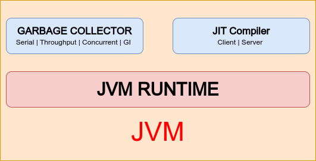

# JRE & JDK

- JRE (Java Runtime Environment)
  - Provides a runtime environment to execute JAVA based application.
  - Comes with JVM(Java Virtual Machine).
  - An implementation of JAVA SE class library - a set of data structure, algorithm and API to access them.

- JDK(Java Development Kit)
    - Development tool for JAVA SE application. along with other tool like Java Compiler, JConsole
---
# JVM Component

- JVM Runtime : Provide runtime environment
  - It performs responsibility like, Start/Stop VM, Class loading,Command line argument parsing, Error/Exception handling, Java bytecode interpreter, thread management, synchronization, handle java native interface.
   
- Garbage collector / Memory manager : Manages memory allocation and garbage collection.
  - Most java object are un-used and eligible to reclaimed very quickly. But some are live for longer period of time. As a result, **Garbage collector is one who partitions the java heap into 2(or more) region of generations to maintain life cycle of object. The most common form of garbage collector is who has young generation and old generation. Young generation(for newly allocated objects) and old generation (for longer lived object)**.
  - JVM(Memory manager/Garbage collector) move longer lived object from **young generation to old generation.**
  - There is also a third generation called **permanent generation, which holds metadata such as class data structure. Object from Old generation never migrated into permanent generation.**
  - From java 8, **Permanent generation is eliminated in favor of space or region referred as metaspace.**
  - Garbage collector/ Memory manager which works in fashion of creating region(memory space) based on object generation are called as **generational garbage collector**.
  - Available garbage collector are:
    - Serial GC : It is a single threaded stop the world young generation collector, and a single threaded stop the world old generation collector.
    - Throughput GC (Parallel GC) : It is a multithreaded stop the world young generation collector, and a multithreaded stop the world old generation collector.
    - Garbage-First (G1) : It is a multithreaded stop the world young generation collector, and a multithreaded stop the world old generation collector.
    - Z Garbage Collector(Z GC) : its multithreaded low-latency  
   
- JIT compiler : Take java **bytecode and generate native assembly instruction**.
  - Prior to JAVA 8, there are, Client JVM - designed for rapid application startup. And Server JVM - for highly optimized, and generate high performing code with cost of slow application start up.
  - From JAVA 8, There is Tiered one - which behave like client JVM and continue to optimize the generated code until it reach to level of server JVM.

---
# TODO

- Explore Z GC.
- 

# References
- <a href="https://docs.oracle.com/en/java/javase/17/gctuning/available-collectors.html#GUID-F215A508-9E58-40B4-90A5-74E29BF3BD3C" target="_blank">Available garbage collector</a>
