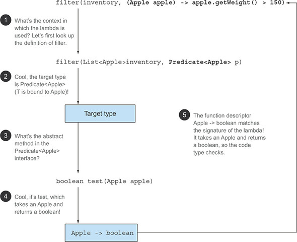

- A `lambda` expression can be understood as a concise representation of an **anonymous function**. As it is anonymous,
  it
  does not have name: but have list of a parameters, a body, a return type and possible list of exception.
- **`lambda` is an inline implementation of functional interface**. which implies, `lambda` only be used in context
  of `functional interface` & `lambda` is a `class` of type `functional interface`.
- A `lambda` expression itself does not contain the information about which functional interface it is implementing.
- `lambda` area allowed to capture(to reference in their body) instance variable and static variables without
  restrictions. But when local variables are captured, They have to explicitly declare `final` or be effectively `final.
- In java 8, Designer introduce `functional interface` which have only one abstract method and that method directly
  invoked by `lambda`.
- Above sentence implies that, When interface have more than one abstract method, lambda failed to identify which
  abstract method to invoke.
- In java 8, Designer introduce inbuilt `functional interface` (`Predicate`,`Function`,`Consumer`,...) which define
  the contract for general purpose lambda handling. so we do need to write `functional interface` for our own need.

- Below image depicts about: How the type checking happening for lambda behind the scene.

